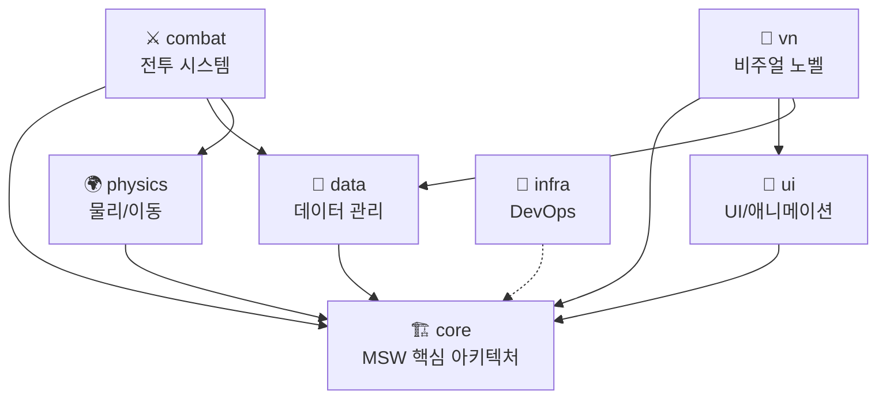

# 📐 프로젝트 구조도 (Project Structure)
> **최종 업데이트**: 2026-02-13
> 이 문서는 프로젝트의 전체 구조와 모듈 간 의존 관계를 정의합니다.
> 다른 AI가 프로젝트를 인계받을 때, 이 문서를 가장 먼저 읽어야 합니다.

---

## 📁 폴더 구조

```
mswproject/
│
├── 📄 AI_KNOWLEDGE_BRIDGE.md    # AI 간 지식 전달 마스터 문서
├── 📄 PROJECT_STRUCTURE.md      # ← 이 파일 (프로젝트 지도)
├── 📄 DATA_SCHEMA.md            # 데이터 시트 명세서
├── 📄 custom_rules.md           # AI 행동 규칙
│
├── 📂 _scripts/                 # DevOps 및 자동화 도구
│   ├── sync_ai.ps1              # AI 기억 ↔ Git 동기화
│   ├── export_context.ps1       # AI 맥락 내보내기 (모듈별 지원)
│   ├── restore_ai.ps1           # AI 기억 복원
│   ├── brain_to_skill.ps1       # 브레인 → 스킬 변환
│   └── .ai_backup/              # AI 데이터 백업 저장소
│
├── 📂 skill/                    # MSW 스킬 및 리소스
│   └── mswproject-brain/        # 브레인 기반 스킬 레퍼런스
│
└── 📂 .agent/                   # AI 워크플로우 정의
    └── workflows/
        └── session_wrapup.md    # 세션 마무리 체크리스트
```

---

## 🧩 모듈 정의

대형 프로젝트를 위해 다음과 같이 모듈을 분류합니다. 
`export_context.ps1 -Module <모듈명>`으로 특정 모듈의 맥락만 추출할 수 있습니다.

| 모듈명 | 태그 키워드 | 설명 |
| :--- | :--- | :--- |
| `core` | ECP, Entity, Component, Lifecycle | MSW 핵심 아키텍처 및 엔진 기초 |
| `combat` | Attack, Hit, Damage, Skill, Battle | 전투 시스템 (Attack/Hit/Stat) |
| `vn` | VisualNovel, Dialog, Scene, Story | 비주얼 노벨 엔진 |
| `ui` | UI, Button, TextInput, Tween | UI 컴포넌트 및 애니메이션 |
| `data` | DataStorage, Save, Load, Schema | 데이터 저장/불러오기/시트 관리 |
| `physics` | Rigidbody, Collider, TileMap, Joint | 물리 및 이동 시스템 |
| `infra` | Git, Script, Sync, Export, DevOps | 개발 인프라 및 자동화 도구 |

---

## 🔗 모듈 의존 관계



---

## 📝 새 모듈 추가 시 체크리스트

1. 위 모듈 정의 테이블에 새 모듈 추가
2. Mermaid 다이어그램에 의존 관계 반영
3. `DATA_SCHEMA.md`에 관련 데이터 시트가 있으면 추가
4. `export_context.ps1`의 모듈 키워드 매핑에 추가

---
*이 문서는 프로젝트의 '지도' 역할을 합니다. 모듈 구조가 변경될 때마다 업데이트하세요.*
