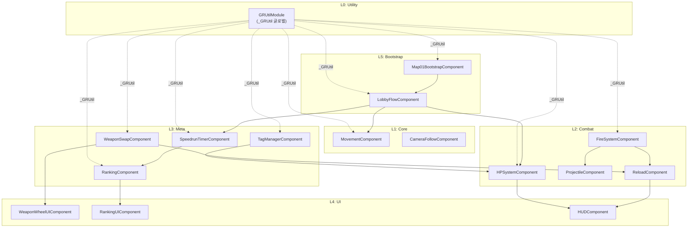

# 🔧 Project GR — 스크립트 모듈화 계획서 v2

## 1. 기존 컴포넌트 삭제 리스트

> 사용자 직접 삭제. Maker에서 아래 [.codeblock](file:///c:/Users/ksh00/Documents/GitHub/mswproject/mswproject/RootDesk/MyDesk/ProjectGR/Components/LobbyFlowComponent.codeblock) 파일 제거.

| # | 삭제 대상 | Maker 경로 | 비고 |
|---|---|---|---|
| 1 | `MovementComponent` | `ProjectGR/Components/MovementComponent.codeblock` | |
| 2 | `CameraFollowComponent` | `ProjectGR/Components/CameraFollowComponent.codeblock` | |
| 3 | `HPSystemComponent` | `ProjectGR/Components/HPSystemComponent.codeblock` | |
| 4 | `ReloadComponent` | `ProjectGR/Components/ReloadComponent.codeblock` | |
| 5 | `FireSystemComponent` | `ProjectGR/Components/FireSystemComponent.codeblock` | |
| 6 | `ProjectileComponent` | `ProjectGR/Components/ProjectileComponent.codeblock` | |
| 7 | `WeaponSwapComponent` | `ProjectGR/Components/WeaponSwapComponent.codeblock` | |
| 8 | `WeaponWheelUIComponent` | `ProjectGR/Components/WeaponWheelUIComponent.codeblock` | |
| 9 | `TagManagerComponent` | `ProjectGR/Components/TagManagerComponent.codeblock` | |
| 10 | `SpeedrunTimerComponent` | `ProjectGR/Components/SpeedrunTimerComponent.codeblock` | |
| 11 | `RankingComponent` | `ProjectGR/Components/RankingComponent.codeblock` | |
| 12 | `RankingUIComponent` | `ProjectGR/Components/RankingUIComponent.codeblock` | |
| 13 | `LobbyFlowComponent` | `ProjectGR/Components/LobbyFlowComponent.codeblock` | |
| 14 | `Map01BootstrapComponent` | `ProjectGR/Components/Map01BootstrapComponent.codeblock` | |

### 함께 정리할 파일들

| 파일 | 위치 | 사유 |
|---|---|---|
| [FLOW_TEST_GAP_PLAN.md](file:///c:/Users/ksh00/Documents/GitHub/mswproject/mswproject/RootDesk/MyDesk/ProjectGR/FLOW_TEST_GAP_PLAN.md) | `ProjectGR/` | 구버전 테스트 계획 |
| [REPRO_MANIFEST.json](file:///c:/Users/ksh00/Documents/GitHub/mswproject/mswproject/RootDesk/MyDesk/ProjectGR/REPRO_MANIFEST.json) | `ProjectGR/` | 구버전 재현 매니페스트 |
| [WORKSPACE_REPRODUCE.md](file:///c:/Users/ksh00/Documents/GitHub/mswproject/mswproject/RootDesk/MyDesk/ProjectGR/WORKSPACE_REPRODUCE.md) | `ProjectGR/` | 구버전 재현 문서 |

---

## 2. 새 폴더 구조 (업계 표준 모듈화)

```
RootDesk/MyDesk/ProjectGR/
│
├── Core/                    ← 전투와 무관한 기반 시스템
│   ├── GRUtilModule             ← 🆕 글로벌 유틸 (중복 함수 통합)
│   ├── MovementComponent
│   └── CameraFollowComponent
│
├── Combat/                  ← 전투 관련 (의존 방향: ↓)
│   ├── HPSystemComponent
│   ├── FireSystemComponent
│   ├── ProjectileComponent
│   └── ReloadComponent
│
├── Meta/                    ← 전투 위에 얹는 메타 시스템
│   ├── WeaponSwapComponent
│   ├── TagManagerComponent
│   ├── SpeedrunTimerComponent
│   └── RankingComponent
│
├── UI/                      ← UI 전용 (데이터 표시만, 로직 없음)
│   ├── WeaponWheelUIComponent
│   ├── RankingUIComponent
│   └── HUDComponent             ← 🆕 HP바/잔탄/쿨타임 통합 HUD
│
└── Bootstrap/               ← 초기화/오케스트레이션
    ├── Map01BootstrapComponent
    └── LobbyFlowComponent
```

### MSW Maker 제약 대응

> [!IMPORTANT]
> MSW Maker는 **물리적 폴더 구분이 제한적**일 수 있습니다.  
> Maker에서 폴더 분리가 안 되면, **네이밍 prefix**로 논리적 분리합니다:

| 폴더 | 대안 prefix | 예시 |
|---|---|---|
| `Core/` | 없음 (기본) | `MovementComponent` |
| `Combat/` | `CB_` | `CB_HPSystemComponent` (또는 그대로) |
| `Meta/` | `MT_` | `MT_WeaponSwapComponent` |
| `UI/` | `UI_` | `UI_RankingComponent` |
| `Bootstrap/` | `Boot_` | `Boot_Map01Bootstrap` |

> **권장: 폴더 분리 가능하면 폴더 사용, 불가능하면 prefix 방식 채택**

---

## 3. 모듈 정의

### 3-1. GRUtilModule (🆕 핵심 — 중복 제거)

**목적**: 6개 컴포넌트에 복사되어 있던 공통 유틸리티를 1곳에 통합

```lua
-- 글로벌 테이블 등록 방식
@Component
script GRUtilModule extends Component

    @ExecSpace("ServerOnly")
    method void OnBeginPlay()
        -- 글로벌 유틸 테이블 등록
        if _GRUtil == nil then
            _GRUtil = {}
            _GRUtil.ResolveProjectComponent = function(entity, scriptName, markerField) ... end
            _GRUtil.ResolveMovementComponent = function(entity) ... end
            _GRUtil.TrySetCanMove = function(entity, canMove) ... end
            _GRUtil.CanWriteField = function(comp, fieldName) ... end
            _GRUtil.HasMember = function(comp, memberName) ... end
            _GRUtil.IsOwner = function(entity, senderUserId) ... end
            _GRUtil.TrySetField = function(comp, fieldName, value) ... end
            _GRUtil.FindOrAddComponent = function(entity, typeName) ... end
        end
    end
end
```

**사용 예시** (다른 컴포넌트에서):
```lua
-- Before (각 컴포넌트에 20줄씩 복사)
local movComp = self:ResolveProjectMovementComponent()
self:TrySetMovementCanMove(false)

-- After (1줄)
_GRUtil.TrySetCanMove(self.Entity, false)
```

### 3-2. 각 레이어별 역할 정의

| 레이어 | 참조 규칙 | 설명 |
|---|---|---|
| **Core** | 다른 레이어 참조 금지 | 자기 자신만으로 완결. 외부에서 호출됨 |
| **Combat** | Core만 참조 가능 | HP, 발사, 투사체, 재장전은 서로 참조 가능 |
| **Meta** | Core + Combat 참조 가능 | 무기교체→ReloadComponent, 태그→HPSystem 등 |
| **UI** | 데이터 수신만 | 로직 없음. 다른 레이어에서 `UpdateUI()` 호출 |
| **Bootstrap** | 전체 참조 가능 | 초기화/오케스트레이션만 담당 |

### 3-3. 의존성 흐름



---

## 4. 네이밍 & 코딩 컨벤션

### 파일 네이밍
```
{도메인}{역할}Component.codeblock
```
| 패턴 | 예시 |
|---|---|
| 시스템 컴포넌트 | `HPSystemComponent`, `FireSystemComponent` |
| UI 컴포넌트 | `RankingUIComponent`, `WeaponWheelUIComponent` |
| 유틸 모듈 | `GRUtilModule` (Component 아닌 Module 접미사) |
| 부트스트랩 | `Map01BootstrapComponent` |

### Property 선언 규칙
```lua
-- 1. Sync property 먼저 (네트워크)
@Sync
property boolean IsActive = false

-- 2. Config property (Maker에서 조정)
property number MoveSpeed = 200
property number DamageReduction = 0

-- 3. Internal property (런타임 전용, Maker 노출 불필요)
property Entity _cachedTarget = nil
```

### ExecSpace 규칙
```lua
-- 서버 권위 로직 → [ServerOnly]
@ExecSpace("ServerOnly")
method void ApplyDamage(integer rawDamage) ... end

-- 클라이언트 연출 → [ClientOnly]
@ExecSpace("ClientOnly")
method void UpdateHPBarClient(integer current, integer max) ... end

-- 양쪽 실행 → 내부 분기
method void OnMapEnter(Entity enteredMap)
    if self.Entity.Environment:IsServer() then ... end
    if self.Entity.Environment:IsClient() then ... end
end
```

---

## 5. 실행 순서 (5 Phase)

| Phase | SPEC | 내용 | 산출물 |
|---|---|---|---|
| 0 | `SPEC_GRUtil.md` | 글로벌 유틸 모듈 생성, Maker PoC 확인 | `GRUtilModule.codeblock` |
| 1 | `SPEC_Core.md` | 이동 + 카메라 (중복 유틸 제거) | 2개 컴포넌트 |
| 2 | `SPEC_Combat.md` | HP + 발사 + 투사체 + 재장전 | 4개 컴포넌트 |
| 3 | `SPEC_Meta.md` | 무기교체 + 태그 + 타이머 + 랭킹 | 4개 컴포넌트 |
| 4 | `SPEC_UIBoot.md` | UI 3종 + Bootstrap + LobbyFlow | 5개 컴포넌트 |

> Phase 0 PoC 통과 → Phase 1~4 순차 진행

---

## 6. [FOLDER_RULES.md](file:///c:/Users/ksh00/Documents/GitHub/mswproject/mswproject/%EA%B8%B0%ED%9A%8D%EC%84%9C/0.%EA%B0%9C%EC%9A%94/FOLDER_RULES.md) 업데이트 필요 사항

현재 [FOLDER_RULES.md](file:///c:/Users/ksh00/Documents/GitHub/mswproject/mswproject/%EA%B8%B0%ED%9A%8D%EC%84%9C/0.%EA%B0%9C%EC%9A%94/FOLDER_RULES.md) 코드 구조 섹션:
```
ProjectGR/
├── Components/     ← 평면 구조
└── Common/         ← 미사용
```

변경 후:
```
ProjectGR/
├── Core/           ← 기반 시스템 + GRUtilModule
├── Combat/         ← 전투 도메인
├── Meta/           ← 메타 시스템
├── UI/             ← 순수 UI
└── Bootstrap/      ← 초기화/오케스트레이션
```
