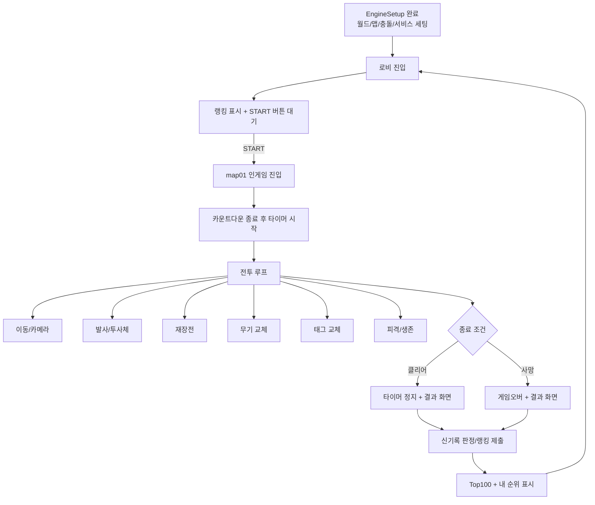

# Project GR 기능 플로우차트 + 테스트/누락 수정 계획

## 1. 기준 문서와 판정 범위
- 기준 문서
- `작업명세서/SPEC_EngineSetup.md`
- `작업명세서/SPEC_Movement.md`
- `작업명세서/SPEC_FireSystem.md`
- `작업명세서/SPEC_HPSystem.md`
- `작업명세서/SPEC_ReloadSystem.md`
- `작업명세서/SPEC_WeaponSwap.md`
- `작업명세서/SPEC_TagSystem.md`
- `작업명세서/SPEC_SpeedrunTimer.md`
- `작업명세서/SPEC_RankingSystem.md`
- `기획서/0.개요/projectGR_main_proposal.md`
- 판정 방식
- 2026-02-18 기준 로컬 워크스페이스 정적 대조(mlua/codeblock/map/model/config)
- 런타임 플레이 결과는 아래 테스트 케이스로 별도 기록

## 2. 목표 기능 플로우차트 (기획서 + 지침서 기준)

## 3. 테스트 케이스 매트릭스
| ID | 테스트 내용 | 기대 결과 | 기준 문서 |
|---|---|---|---|
| ENV-01 | ProjectGR 스크립트 포맷 확인 | `Source=0`+`.mlua` 본문 또는 `Source=1`+`Target` 본문 | SPEC_EngineSetup |
| ENV-02 | `DefaultPlayer.model` 컴포넌트/물리(중력0, Z회전 고정) 확인 | 필수 세팅 충족 | SPEC_EngineSetup |
| ENV-03 | `map01.map`의 `GRProjectileTemplate` 컴포넌트 확인 | `SpriteRenderer`, `Trigger`, `IsLegacy=false` | SPEC_EngineSetup |
| ENV-04 | `CollisionGroupSet` 충돌 매트릭스 확인 | Player/Enemy/Projectile/Terrain 규칙 충족 | SPEC_EngineSetup |
| LOB-01 | 로비에서 START 버튼 클릭 | 서버 로그 + 시작 요청 수신 | SPEC_EngineSetup |
| LOB-02 | START 후 `map01` 이동 | 인게임 맵 전환 및 전투 HUD 전환 | SPEC_EngineSetup |
| MOV-01 | WASD/대각 입력 | 8방향 이동 + 대각선 속도 보정 | SPEC_Movement |
| FIR-01 | 클릭 발사 | 회전 후 투사체 생성/이동/충돌 소멸 | SPEC_FireSystem |
| FIR-02 | 탄약 0 상태에서 발사 시도 | 발사 차단 + 재장전 필요 피드백 | SPEC_FireSystem |
| REL-01 | R 재장전 | 재장전 중 발사 불가, 완료 후 탄약 최대치 | SPEC_ReloadSystem |
| REL-02 | 재장전 중 태그/무기교체 | 재장전 취소, 탄약 미충전 | SPEC_ReloadSystem, SPEC_TagSystem |
| WSW-01 | F로 무기 교체 UI 열기/닫기 | 이동/공격 차단, 슬롯 선택/확정/취소 동작 | SPEC_WeaponSwap |
| TAG-01 | Q 태그 교체 | HP/탄약/무기 상태 스왑, 쿨타임/무적 적용 | SPEC_TagSystem |
| HP-01 | 피격/무적/사망 | 서버 권위 HP 감소, 무적 창, 사망 처리 | SPEC_HPSystem |
| TMR-01 | 스테이지 시작/중지/재시작 | 타이머 시작/정지/리셋 정상 | SPEC_SpeedrunTimer |
| RNK-01 | 결과 시 랭킹 제출 후 조회 | Top100 + 내 순위 표시 | SPEC_RankingSystem |
| RNK-02 | 타임어택/무한모드 탭 전환 | 모드별 정렬 규칙 반영 | SPEC_RankingSystem |

## 4. 현재 구현 대조 (2026-02-18)
| 영역 | 상태 | 근거 파일 | 누락/리스크 |
|---|---|---|---|
| 엔진 세팅(파일 기반) | 구현됨 | `mswproject/Global/WorldConfig.config`, `mswproject/Global/CollisionGroupSet.collisiongroupset`, `mswproject/map/map01.map`, `mswproject/Global/DefaultPlayer.model` | Maker 수동 항목(리소스, 서비스 ON, 물리값)은 런타임 확인 필요 |
| 로비 시작 플로우 | 부분구현 | `mswproject/RootDesk/MyDesk/ProjectGR/Components/LobbyFlowComponent.mlua`, `mswproject/map/lobby.map` | 버튼 클릭 미동작 케이스 재현/원인 고정 필요 |
| 이동/카메라 | 구현됨 | `mswproject/RootDesk/MyDesk/ProjectGR/Components/MovementComponent.mlua`, `mswproject/RootDesk/MyDesk/ProjectGR/Components/CameraFollowComponent.mlua` | 포커스 손실 시 키 정리 흐름 명시 부족 |
| 발사/투사체 | 부분구현 | `mswproject/RootDesk/MyDesk/ProjectGR/Components/FireSystemComponent.mlua`, `mswproject/RootDesk/MyDesk/ProjectGR/Components/ProjectileComponent.mlua` | 빈 탄창 UI/사운드, 총구/피격 이펙트, 풀링 미구현 |
| 재장전 | 부분구현 | `mswproject/RootDesk/MyDesk/ProjectGR/Components/ReloadComponent.mlua` | "비활성 무기 백그라운드 재장전 흐름" 해석/검증 필요 |
| 무기 교체 | 부분구현 | `mswproject/RootDesk/MyDesk/ProjectGR/Components/WeaponSwapComponent.mlua`, `mswproject/RootDesk/MyDesk/ProjectGR/Components/WeaponWheelUIComponent.mlua` | 월드 전체 시간정지 정책과 방사형 하이라이트 UI 미완 |
| 태그 교체 | 부분구현 | `mswproject/RootDesk/MyDesk/ProjectGR/Components/TagManagerComponent.mlua` | 아바타 외형 교체, Entry Skill 실동작 미구현 |
| HP/게임오버 | 부분구현 | `mswproject/RootDesk/MyDesk/ProjectGR/Components/HPSystemComponent.mlua` | 위기 연출/결과 UI는 로그 수준 |
| 스피드런 타이머 | 부분구현 | `mswproject/RootDesk/MyDesk/ProjectGR/Components/SpeedrunTimerComponent.mlua` | 카운트다운 시작 흐름 및 상점/메뉴 pause 연계 미완 |
| 랭킹 | 부분구현 | `mswproject/RootDesk/MyDesk/ProjectGR/Components/RankingComponent.mlua`, `mswproject/RootDesk/MyDesk/ProjectGR/Components/RankingUIComponent.mlua` | 무한모드 실제 연계, UI 상세(날짜/메달/탭 UX) 미완 |

## 5. 누락 우선순위 백로그 (차근차근 수정 순서)
### P0. 플레이 불가/재현 불가 차단
1. START 버튼 클릭 불가 재현 고정 및 입력 루트 단일화 (`LOB-01`, `LOB-02`)
2. EngineSetup 수동 항목 검증 체크리스트 고정 (`ENV-02`, `ENV-04`)
3. 런타임 스모크 테스트 루프 확정 (로비->인게임->기본 전투) (`MOV-01`, `FIR-01`, `REL-01`)

### P1. 핵심 시스템 명세 미충족
1. 태그 외형 교체 + Entry Skill 실제 동작 (`TAG-01`)
2. 타이머 카운트다운 시작/중지 이벤트 체계화 (`TMR-01`)
3. 무기 교체 중 시간정지 정책 확정(TimeScale vs 로직 플래그) (`WSW-01`)
4. 랭킹 제출 타이밍과 결과 화면 연동 고정 (`RNK-01`)

### P2. UX/완성도/성능
1. 발사/피격/빈탄창 사운드 및 이펙트 (`FIR-02`, `HP-01`)
2. 랭킹 UI 상세화(탭 UX, 날짜, 표시 포맷) (`RNK-02`)
3. 투사체 풀링 적용 (`FIR-01`)

## 6. 실행 규칙
1. 수정은 P0 -> P1 -> P2 순서만 진행
2. 각 수정 후 연결된 테스트 ID만 먼저 재검증
3. PASS 확인 후 다음 항목 진행
4. `.mlua` 코드 수정 시 `기획서/4.부록/Code_Documentation.md` 동시 갱신

## 7. 테스트 결과 기록 템플릿
| ID | 결과(PASS/FAIL) | 날짜 | 비고 |
|---|---|---|---|
| ENV-01 |  |  |  |
| ENV-02 |  |  |  |
| ENV-03 |  |  |  |
| ENV-04 |  |  |  |
| LOB-01 |  |  |  |
| LOB-02 |  |  |  |
| MOV-01 |  |  |  |
| FIR-01 |  |  |  |
| FIR-02 |  |  |  |
| REL-01 |  |  |  |
| REL-02 |  |  |  |
| WSW-01 |  |  |  |
| TAG-01 |  |  |  |
| HP-01 |  |  |  |
| TMR-01 |  |  |  |
| RNK-01 |  |  |  |
| RNK-02 |  |  |  |
