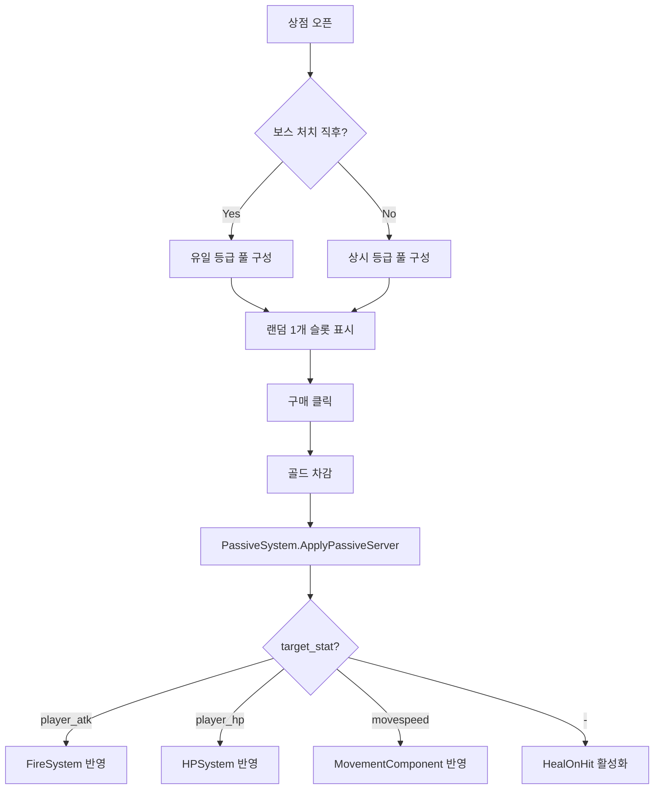

# 🟢 완료

---

**[Codex용 작업 명세서]**

## 상태 이력

| 일시 | 상태 | 비고 |
|---|---|---|
| 2026-02-28 | 🟡 대기중 | 패시브 드롭 선택 패널 클릭 후 미닫힘 이슈 확인 시작 |
| 2026-02-28 | 🔵 진행중 | `PassiveSelectionUIComponent` 클릭 콜백/닫힘 동기화 로직 수정 |
| 2026-02-28 | 🟢 완료 | 패널 닫힘/선택 처리 버그 수정 및 문서 갱신 완료 |

---

## 1. 개요

상점에서 패시브 슬롯 구매 시 실제 스탯을 변경하는 `PassiveSystemComponent`를 신규 구현하고, 기존 `ShopManagerComponent`의 placeholder 패시브 로직을 연결한다.

---

## 2. 컴포넌트 정의

* **Component Name:** `PassiveSystemComponent`
* **Execution Space:** `[Server Only]` (스탯 변경 서버 권위)
* **파일 경로:** `RootDesk/MyDesk/ProjectGR/Components/Meta/PassiveSystemComponent.mlua`

---

## 3. Properties

| 이름 | 타입 | 기본값 | 설명 |
|---|---|---|---|
| `PassiveDataTableName` | string | `"PassiveData"` | 패시브 데이터 테이블명 |
| `AcquiredPassiveCount` | integer (Sync) | `0` | 현재 보유 패시브 수 |
| `MaxPassiveSlots` | integer | `20` | 최대 패시브 보유 한도 |
| `EnableDebugLogs` | boolean | `true` | 디버그 로그 출력 |

---

## 4. Required MSW Services

* `_DataService` — PassiveData 테이블 로드

---

## 5. 연동 컴포넌트

| 컴포넌트 | 연동 방식 |
|---|---|
| `ShopManagerComponent` | `ApplyPurchaseEffectServer("passive", slotData)` → `PassiveSystemComponent:ApplyRandomPassiveServer()` 호출 |
| `FireSystemComponent` | `PassiveFlatAttack`, `PassiveIncreasePercent` 프로퍼티에 공격력 패시브 누적 |
| `MovementComponent` | `SpeedMultiplier` 프로퍼티에 이속 패시브 반영 |
| `HPSystemComponent` | `MaxHP` 프로퍼티에 체력 패시브 반영 (CurrentHP도 비율 유지) |
| `TagManagerComponent` | 태그 스왑 시 패시브 상태를 캐릭터별로 Export/Import |
| `LobbyFlowComponent` | 런 종료 시 `ResetPassivesServer()` 호출 |
| `CharacterDataInitComponent` | 캐릭터 기본 스탯(`player_a_stat`, `player_b_stat`) 참조용 |
| `Map01BootstrapComponent` | `AttachRequiredComponentsServer`에 PassiveSystemComponent 추가 |

---

## 6. DataTable 설계 — `PassiveData`

| 컬럼명 | 타입 | 설명 | 예시 |
|---|---|---|---|
| `id` | string (PK) | 패시브 고유 ID | `"passive_01"` |
| `name` | string | 표시명 | `"상시 패시브 1"` |
| `grade` | string | 등급 (`"상시"` / `"유일"`) | `"상시"` |
| `description` | string | 설명 | `"체력 증가"` |
| `target_stat` | string | 적용 스탯 키 (`player_hp`/`player_atk`/`movespeed`) | `"player_hp"` |
| `player_a` | string | 캐릭터 A 슬롯 (`player_hp`/`player_atk`/`movespeed`/`-`) | `"player_hp"` |
| `player_b` | string | 캐릭터 B 슬롯 (`player_hp`/`player_atk`/`movespeed`/`-`) | `"player_hp"` |
| `pass_value` | number | 능력치 증가량 (5=고정덧셈, 0.05=5%비율) | `5` |
| `price` | integer | 상점 가격 | `1500` |

---

## 7. 출현 규칙

1. 보스 **미처치** 시 → `grade == "상시"` 패시브 3개 중 1개 선택
2. `"유일"` 등급은 한번 선택하면 재등장 **불가**
3. 상점 구매 시 랜덤 풀에서 등급 조건에 맞는 1개를 뽑아 즉시 적용
4. 보스 **처치** 직후 → `grade == "유일"` 패시브 3개 중 1개 선택
5. `"상시"` 등급 패시브는 **한번** 선택하면 적용 **후에도** 재등장함
6. `"상시"` 등급은 퍼센트 증가 시 **재적용** 아닌 **단순 덧셈** 처리

---

## 8. 수식 체계

### 8-1. 상시 패시브 1 (pass_value가 정수 = 고정 덧셈)

```
캐릭터 A: 패시브 적용전 캐릭터 A 스탯(player_a_stat) + 능력치 증가량(pass_value)
캐릭터 B: 패시브 적용전 캐릭터 B 스탯(player_b_stat) + 능력치 증가량(pass_value)
```
> 능력치 증가량이 정수면 단순 덧셈 처리

### 8-2. 상시 패시브 2~16 (pass_value가 소수 = 비율 곱)

```
캐릭터 A: 패시브 적용전 캐릭터 A 스탯(player_a_stat) * (1 + 능력치 증가량(pass_value))
캐릭터 B: 패시브 적용전 캐릭터 B 스탯(player_b_stat) * (1 + 능력치 증가량(pass_value))
```
> 목적가가 아닌 현재 해당 캐릭터의 스탯에 능력치 증가량 비율을 곱한 뒤 덧셈 처리

### 8-3. 유일 패시브 1, 2 (비율 곱 — 상시와 동일)

```
캐릭터 A: 패시브 적용전 캐릭터 A 스탯(player_a_stat) * (1 + 능력치 증가량(pass_value))
캐릭터 B: 패시브 적용전 캐릭터 B 스탯(player_b_stat) * (1 + 능력치 증가량(pass_value))
```

### 8-4. 유일 패시브 3 (20회 공격 당 현재 체력 1회복)

> `target_stat == "-"` → 별도 로직. 누적 공격 횟수 카운터 유지, 20회마다 HP 1 회복
> 플레이어에 누적 공격 횟수 카운터 프로퍼티 추가 필요

### 8-5. 유일 패시브 4 (고정 HP 덧셈)

```
캐릭터 A: player_hp + pass_value (50)
캐릭터 B: player_hp + pass_value (50)
```

---

## 9. Logic Architecture

### 9-1. 초기화 (`OnBeginPlay`)

1. `_DataService:GetTable(PassiveDataTableName)` → 전체 행 캐시
2. `_T.AcquiredList = {}` (보유 패시브 ID 목록)
3. `_T.UniqueUsed = {}` (사용된 유일 패시브 ID 세트)
4. `_T.AttackHitCounter = 0` (유일 패시브 3용)
5. `_T.HasHealOnHitPassive = false`

### 9-2. 패시브 풀 구성 (`BuildPassivePoolServer`)

- `grade` 필터: 보스 직후 → `"유일"`, 그 외 → `"상시"`
- `"유일"` 중 `_T.UniqueUsed`에 포함된 것 제외
- 풀에서 랜덤 3개 추출 → 상점 슬롯 구성용 반환
- 3개 미만이면 가용한 만큼만

### 9-3. 핵심 로직 (`ApplyPassiveServer`)

```pseudocode
row = PassiveData[passiveId]
statKey = row.target_stat
passValue = row.pass_value

if statKey == "player_atk" then
    -- FireSystemComponent로 적용
    if passValue가 정수(>=1) then PassiveFlatAttack += passValue
    else 현재ATK * passValue 만큼 PassiveFlatAttack에 가산
elseif statKey == "player_hp" then
    -- HPSystem으로 적용
    if passValue가 정수(>=1) then MaxHP += passValue
    else MaxHP += math.floor(MaxHP * passValue)
    -- CurrentHP 비율 유지
elseif statKey == "movespeed" then
    -- MovementComponent로 적용
    if passValue가 정수(>=1) then MoveSpeed += passValue
    else MoveSpeed += MoveSpeed * passValue
elseif statKey == "-" then
    -- 유일#3: HealOnHit 플래그 활성화
    _T.HasHealOnHitPassive = true
end

-- 유일 등급이면 UniqueUsed에 등록
-- AcquiredList에 추가
```

### 9-4. 20회 공격 체력회복 (`OnProjectileFiredServer`)

```pseudocode
if _T.HasHealOnHitPassive == false then return
_T.AttackHitCounter += 1
if _T.AttackHitCounter >= 20 then
    _T.AttackHitCounter = 0
    HPSystem:Heal(1)
end
```
> `FireSystemComponent`에서 투사체 발사 성공 시 이 함수 호출 필요

### 9-5. 런 리셋 (`ResetPassivesServer`)

- `PassiveFlatAttack = 0`, `PassiveIncreasePercent = 0`
- `SpeedMultiplier = 1`
- `MaxHP` 원래 캐릭터 데이터로 복원
- `_T.AcquiredList = {}`, `_T.UniqueUsed = {}`, `_T.AttackHitCounter = 0`
- `_T.HasHealOnHitPassive = false`
- `AcquiredPassiveCount = 0`

### 9-6. 태그 연동

- `ExportPassiveState()` → `{AcquiredList, UniqueUsed, AttackHitCounter, HasHealOnHitPassive}` 반환
- `ImportPassiveState(state)` → 캐릭터별 저장된 상태 복원
- 패시브 스탯은 캐릭터별 player_a/player_b 슬롯으로 분리 적용되므로, 태그 스왑 시 현재 캐릭터의 **스탯 스냅샷**이 `TagManagerComponent.CaptureCurrentCharacterState` → `ApplyCharacterState`에서 처리됨
- 패시브 목록 자체(`AcquiredList`, `UniqueUsed`)는 **양 캐릭터 공유** → 태그 시 별도 처리 불필요

---

## 10. ShopManagerComponent 수정 사항

`ApplyPurchaseEffectServer`의 `"passive"` 분기에서:

```pseudocode
-- 기존: log("placeholder")
-- 변경:
local passiveSystem = self:ResolveComponentSafe(self.Entity, "PassiveSystemComponent", "AcquiredPassiveCount")
if passiveSystem ~= nil and passiveSystem.ApplyRandomPassiveServer ~= nil then
    passiveSystem:ApplyRandomPassiveServer(grade)  -- grade: "상시" or "유일"
end
```

**추가**: 상점 슬롯에 패시브 이름/설명 표시를 위해 `BuildSlotDataServer("passive")` 수정:
- `PassiveSystemComponent:GetNextPassiveCandidateServer()` 호출하여 후보 패시브 정보(이름, 설명, 가격) 획득
- 후보가 없으면 SoldOut 처리

---

## 11. 상점 패시브 슬롯 동작 플로우



---

## 12. Map01BootstrapComponent 수정 사항

`AttachRequiredComponentsServer`에 아래 추가:

```
self:FindOrAddComponentSafe(playerEntity, "PassiveSystemComponent")
```

---

## 13. LobbyFlowComponent 수정 사항

`HandleRunCompletedServer` / `SetLobbyStateServer(true)` 경로에서:

```
local passiveSystem = self:ResolveComponentSafe(self.Entity, "PassiveSystemComponent", "AcquiredPassiveCount")
if passiveSystem ~= nil and passiveSystem.ResetPassivesServer ~= nil then
    passiveSystem:ResetPassivesServer()
end
```

---

## 14. 기획서 참조

* `기획서/2.세부 시스템/v.2.0 패시브 통합 (구현 양식 버전) - 통합1.jpg`
* `기획서/2.세부 시스템/v.2.0 패시브 통합 (구현 양식 버전) - 통합2.jpg`

---

## 15. 구현 방식

MCP 이용해서 직접 workspace에서 작업해줘야하는 방식

---

## 16. 주의/최적화 포인트

* **서버 권위**: 모든 스탯 변경은 서버에서만 수행. 클라이언트는 Sync로만 결과 수신
* **OnUpdate 사용 금지**: 패시브 적용은 이벤트 기반(구매 시점 1회 실행)
* **nil/isValid 방어**: 모든 컴포넌트 참조에 `ResolveComponentSafe` 사용
* **유일 패시브 중복 방지**: `_T.UniqueUsed` 세트로 중복 체크
* **20회 공격 카운터**: 서버에서만 카운트, FireSystemComponent 발사 성공 이벤트에 연동
* **태그 스왑 안전**: 패시브 목록은 양 캐릭터 공유, 스탯은 캐릭터별 적용이므로 태그 시 스탯 복원은 기존 TagManager 플로우가 처리

---
